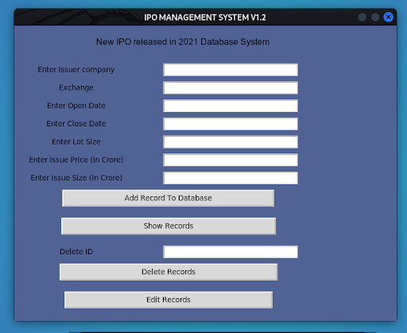

# IPO-Management-System
It is a database-dependent application that basically provides users access to IPO which is the official index of the Bombay Stock Exchange (BSE), Small   and Medium-Sized Enterprises(SME). The application has unlimited storage to store New Initial Public Offering(IPO) released in the year 2021 which      constitutes the Sensex.

The application is made using python and consists of a GUI.

# Technologies Used:
(i)Python (ii) SQLite

 
